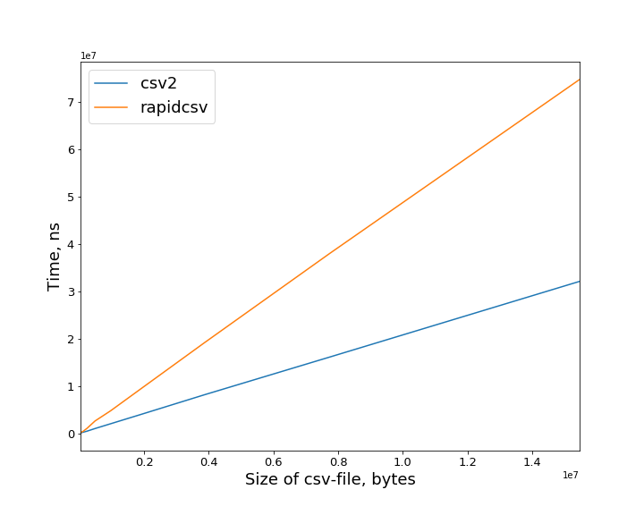
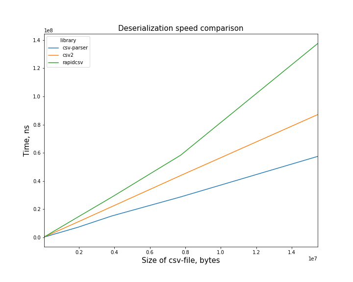

# csv-libs-benchmark
Tiny benchmark of serialization/deserialization by csv libraries.

Libraries tested on:

- [rapidcsv](https://github.com/d99kris/rapidcsv)
- [csv-parser by Aria](https://github.com/AriaFallah/csv-parser)
- [csv2](https://github.com/p-ranav/csv2)

Benchmark library is [google-benchmark](https://github.com/google/benchmark).

### Serialization

note: csv-parser is just parser and it's serialization is just deserialization + output to stream.

| size of file (Mb) |             csv2 |         rapidcsv |
|------------------:|-----------------:|-----------------:|
|      0.032        | 118656           | 246188           |
|      0.06         | 214969           | 430014           |
|      0.111        | 404165           | 939131           |
|      0.225        | 830555           |      2.20763e+06 |
|      0.46         |      1.90252e+06 |      4.61613e+06 |
|      0.922        |      3.62357e+06 |      9.61162e+06 |
|      1.8          |      7.42838e+06 |      1.89398e+07 |
|      3.7          |      1.45244e+07 |      3.70564e+07 |
|      7.4          |      2.88656e+07 |      7.50793e+07 |
|     14.8          |      5.8881e+07  |      1.48913e+08 |

### Deserialization

| size of file (Mb |       csv-parser |             csv2 |         rapidcsv |
|-----------------:|-----------------:|-----------------:|-----------------:|
|      0.032       | 235183           | 373781           | 444579           |
|      0.06        | 448198           | 691737           | 859778           |
|      0.111       | 903363           |      1.26563e+06 |      1.57746e+06 |
|      0.225       |      1.51967e+06 |      2.57224e+06 |      3.08174e+06 |
|      0.46        |      3.3756e+06  |      4.90776e+06 |      6.67261e+06 |
|      0.922       |      6.33493e+06 |      1.04298e+07 |      1.28832e+07 |
|      1.8         |      1.3384e+07  |      2.13559e+07 |      2.74474e+07 |
|      3.7         |      2.70373e+07 |      4.18979e+07 |      5.14353e+07 |
|      7.4         |      4.85074e+07 |      8.11836e+07 |      1.078e+08   |
|     14.8         |      1.03104e+08 |      1.60762e+08 |      2.62322e+08 |

