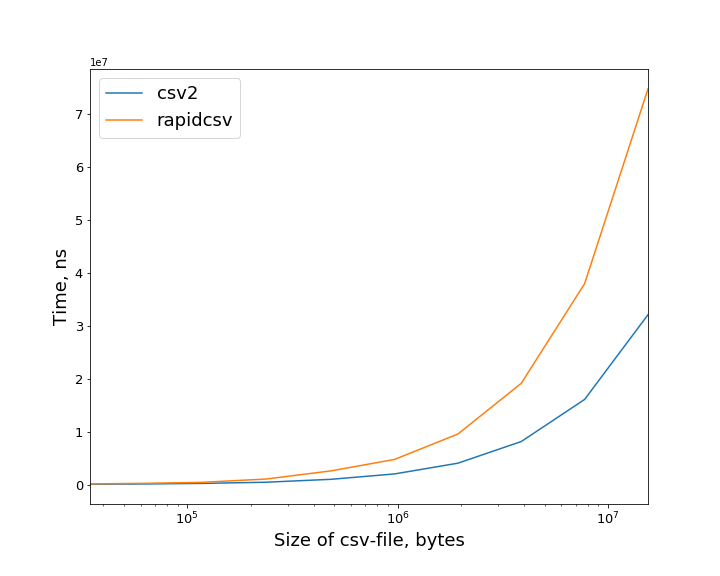
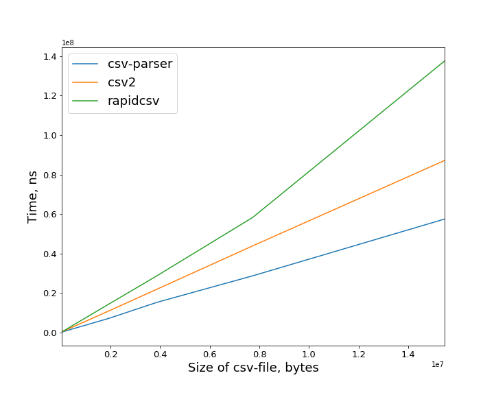

# csv-libs-benchmark
Tiny benchmark of serialization/deserialization by csv libraries.

Libraries tested on:

- [rapidcsv](https://github.com/d99kris/rapidcsv)
- [csv-parser by Aria](https://github.com/AriaFallah/csv-parser)
- [csv2](https://github.com/p-ranav/csv2)

Benchmark library is [google-benchmark](https://github.com/google/benchmark).

### Serialization

note: csv-parser is just parser and it's serialization is just deserialization + output to stream.

|   size of file, B |             csv2 |         rapidcsv |
|------------------:|-----------------:|-----------------:|
|             34524 |  65376           | 129929           |
|             62540 | 118219           | 234127           |
|            117298 | 221518           | 422782           |
|            236268 | 443011           |      1.045e+06   |
|            483449 | 998254           |      2.59491e+06 |
|            966856 |      2.0141e+06  |      4.75831e+06 |
|           1933670 |      4.04479e+06 |      9.56275e+06 |
|           3867298 |      8.14317e+06 |      1.91519e+07 |
|           7734554 |      1.61053e+07 |      3.80005e+07 |
|          15469066 |      3.21229e+07 |      7.48271e+07 |

| | |
|-- |-- |
 | 

### Deserialization

|  size of file, B  |  csv-parser  |    csv2     |  rapidcsv   |
|-------------------|--------------|-------------|-------------|
|       34524       |    124400    |   195415    |   242666    |
|       62540       |    230663    |   351038    |   450417    |
|      117298       |    423383    |   667219    |   820405    |
|      236268       |    821258    | 1.3384e+06  | 1.65915e+06 |
|      483449       | 1.78014e+06  | 2.74588e+06 | 3.54894e+06 |
|      966856       | 3.52419e+06  | 5.42342e+06 | 7.12012e+06 |
|      1933670      | 7.07161e+06  | 1.08487e+07 | 1.43227e+07 |
|      3867298      | 1.51745e+07  | 2.18337e+07 | 2.86201e+07 |
|      7734554      | 2.86447e+07  | 4.38443e+07 | 5.82711e+07 |
|     15469066      | 5.74301e+07  | 8.71222e+07 | 1.3759e+08  |

| | |
|-- |-- |
 | 

### Serialization and deserialization on the one graph: 

deserialization is always slower than serialization.

| | |
|-- |-- 
 | 
